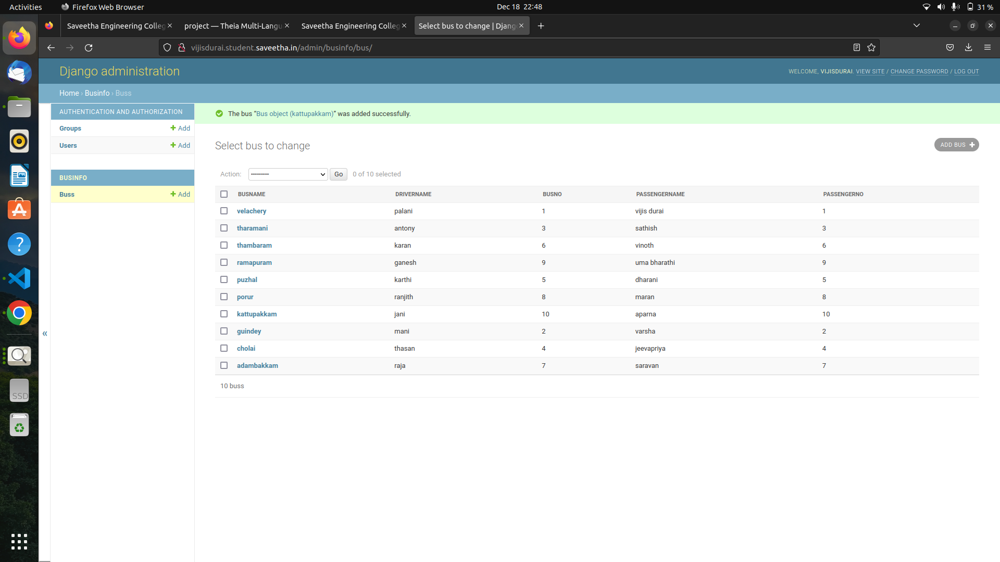

# Django ORM Web Application

## AIM
To develop a Django application to store and retrieve data from a database using Object Relational Mapping(ORM).

## Entity Relationship Diagram


## DESIGN STEPS

### STEP 1:
Clone the repository to theia idle. Start a new app inside the project folder.

### STEP 2:
Type the appropriate code for your table and provide appropriate data types to the columns.

### STEP 3:
create a report about your project in readme.md file and upload the django.orm.app folder to your remote repository 
## PROGRAM

```
from django.db import models

# Create your models here.
from django.db import models
from django.contrib import admin
class Bus(models.Model):
    Busname = models.CharField(max_length=20,primary_key=True)
    drivername = models.CharField(max_length=100)
    busno = models.IntegerField()
    passengername = models.CharField(max_length=100)
    passengerno = models.IntegerField()

class BusAdmin(admin.ModelAdmin):

    list_display = ('Busname','drivername','busno','passengername','passengerno')
```

## OUTPUT




## RESULT

Hence we develop a Django application to store and retrieve data from a database using Object Relational Mapping(ORM).
